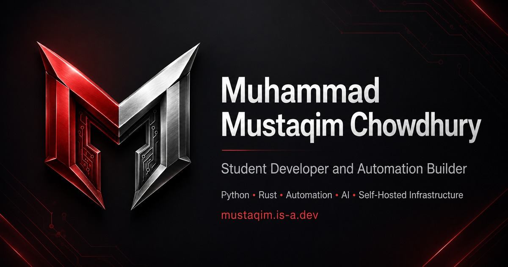

# Muhammad Mustaqim Chowdhury — Portfolio

Personal developer portfolio showcasing my projects, technical skills, certifications, learning journey, and self-hosted systems.

**Live site:** [mustaqim.is-a.dev](https://mustaqim.is-a.dev)



---

## About

I'm a student developer and automation builder based in Qatar with roots in Bangladesh.

I enjoy building practical systems involving:

- Python
- Rust
- JavaScript
- Automation
- AI integrations
- Backend development
- Linux
- Docker
- Self-hosted infrastructure

The portfolio is designed to show not only the technologies I use, but also the projects and systems I build while learning them.

---

## Featured Projects

### QuantumGPT

An AI-powered Discord bot built with JavaScript that connects to external language-model APIs and runs as a managed Linux service.

**Technologies:** JavaScript, Discord.js, APIs, Linux, systemd

---

### Home Lab

A self-hosted Ubuntu Server environment used for Docker services, automation workflows, monitoring, remote access, and backend experiments.

**Technologies:** Ubuntu Server, Docker, Tailscale, Redis, Cloudflare, systemd

---

### Newton Competition Project

A team project created for an inter-school Newton competition.

The project combined a website and game to present the story of Dr. Jabr and the development of the school.

The project achieved **2nd place**.

**Technologies:** HTML, CSS, GameMaker, itch.io

---

### Automated Short-Video Pipeline

An automated workflow for generating narrated short-form videos using text-to-speech, subtitles, rendering, and media processing.

**Technologies:** n8n, Python, FastAPI, Edge TTS, FFmpeg

---

## Contact System

The portfolio includes a real server-side contact form rather than a basic `mailto:` form.

Flow:

```text
Visitor
   ↓
Contact form
   ↓
Cloudflare Turnstile
   ↓
POST /api/contact
   ↓
Cloudflare Pages Function
   ↓
Validation + spam protection
   ↓
Rate limiting
   ↓
Resend API
   ↓
Email
